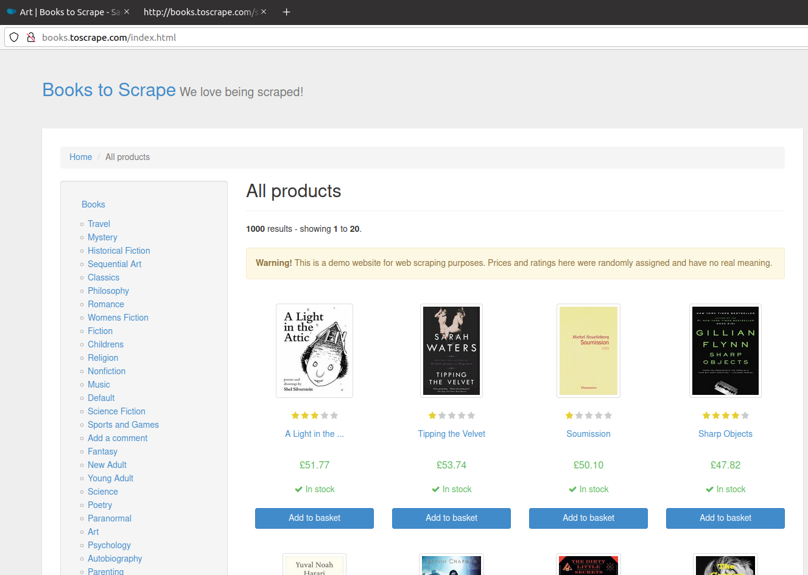

# **Projet 2 - Application Webscraping**
:point_down:    :point_down:    :point_down:

###### Programme Python pour récupérer des données de livres depuis un site internet de vente en ligne books.toscrape.com
## **Préambule**
###### Ce readme.md a pour objectif de décrire comment créer et activer l'environnement virtuel, cloner l'application présent sur un dépôt distant puis exécuter le code d'application ;

### **Pré-requis**

##### Pour commencer ce projet, il est essentiel d’avoir accès aux outils suivants :

- OS Linux
- Terminal linux
- Python et IDE PyCharm
- GitHub et GIT
- Navigateur web

***
## **Installation de l’environnement virtuel**
###### Les étapes suivantes définissent la création et l’activation de l’environnement virtuel necessaire au fonctionnement de l’application python.

_$ cd /P2_ROSSI_KARIM_

_$ python3 –m venv env_

_$ source venv/bin/activate_

_$ pip install –r requirements.txt_

_$ python main.py_
***
## **Récupération de l’application de WebScraping**
##### Ce programme a été réalisé et testé sous __UBUNTU 20.04.2 LTS__ et __PYTHON 3__
Pour cela, Commençons par initialiser le dépôt local et ensuite procédons par le clonage du dépôt distant.

_$ git init

_$ git remote add OC https://github.com/karimOCR/P2_ROSSI_KARIM.git

_$ git branch -M main

_$ git pull OC main

## **Execution du code d’application**
###### Aller dans le Terminal, se placer sous le repertoire /P2_ROSSI_KARIM et executer le script main.py

_$ cd P2_ROSSI_KARIM

_$ python main.py

***
## Développé avec
###### Oracle VirtualBox, UBUNTU version…., PYcharm, Git et GitHub.
* __Système d’exploitation :__ _Ubuntu 20.04.2 LTS_
* __Nom de l’appareil :__ _karim_VirtualBox_
* __Virtualisation :__ _Oracle VirtualBox_
* __Editeur de code :__ _PYcharm_
## Versions
###### *voir après le push*
## Auteurs et contributeurs
* Karim ROSSI alias @karimOCR
* Elie TERRIEN mentor and contributor

